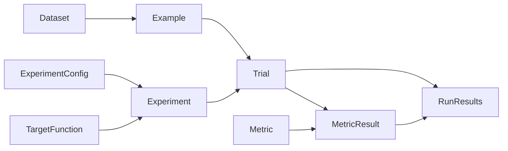
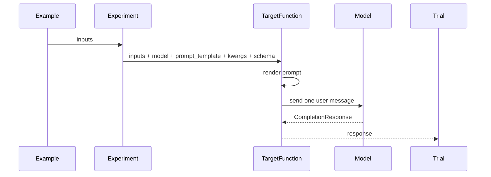
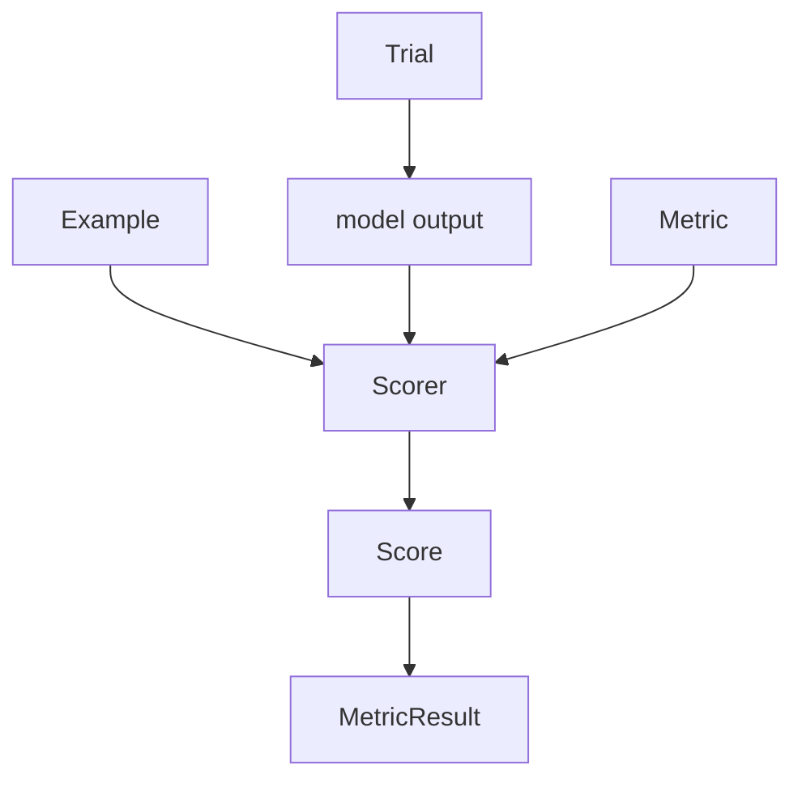
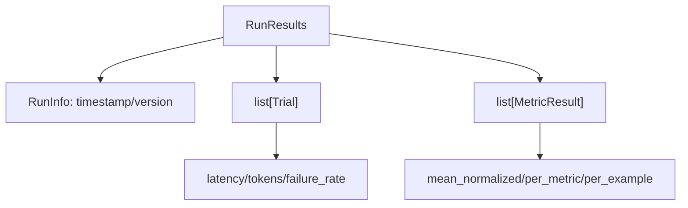

# Language Model Evaluation Harness

LMEH separates **generation** from **scoring**. A target function runs a model and produces trials; metrics score those trials afterwards. This keeps model-calling code, judge code, and reporting code independent.

## 1. The cast



- **Example**: one dataset row. It has `inputs` for the prompt and an optional `reference` answer.
- **Dataset**: a list of examples.
- **ExperimentConfig**: the model, prompt template, generation options, and optional structured output schema to test.
- **TargetFunction**: your model-calling function. It receives an example's inputs plus the experiment config, renders the prompt, calls the model, and returns a `CompletionResponse`.
- **Experiment**: a named pair of `TargetFunction + ExperimentConfig`.
- **Trial**: the result of running one experiment on one example. It stores either the successful model response or the error that occurred.
- **Metric**: a scoring definition: what to measure, whether a reference is needed, the score scale, and the scorer function.
- **MetricResult**: one metric applied to one trial.
- **RunResults**: the complete output of a run: all trials, all metric results, run metadata, and aggregate helpers.

## 2. Generation: examples become trials



The harness does **not** render prompts itself. Prompt rendering belongs to the `TargetFunction`. After the call, the exact prompt can be read from `Trial.rendered_prompt`, which inspects the returned `CompletionResponse`.

If the target fails, the `Trial` stores the exception in `error` instead of a response. The run can continue and failures are reflected in `failure_rate`.

## 3. Scoring: trials become metric results



A `Metric` defines how a trial should be scored:

- `requires_reference` says whether `Example.reference` must exist.
- `scale` validates raw scores and maps them to `[0, 1]`.
- `scorer` computes the score.
- `judge_config`, when present, marks the metric as an LLM-judge metric.

There are two scorer shapes:

```text
DeterministicScorer(output, example) -> Score
StochasticScorer(output, example, judge_config, rendered_prompt) -> Score
```

Deterministic scorers are normal Python checks. Stochastic scorers use an LLM judge and also receive the rendered target prompt, so the judge can evaluate the answer in context.

## 4. Scores and scales

Every scorer returns a `Score`:

```text
Score(raw=<native metric value>, normalized=<0..1>, reason=<optional rationale>)
```

The raw value stays in the metric's own language, while `normalized` gives the harness a common aggregation scale.

Built-in scale types:

- **Range**: a continuous numeric interval, for example `0.0` to `10.0`.
- **Ordinal**: ordered discrete levels, for example `['bad', 'ok', 'great']` or `[1, 2, 3, 4, 5]`.

## 5. The final shape of a run



`RunResults` keeps two parallel views:

1. **Trials**: one per example. Use these for telemetry such as latency, token counts, and failures. This avoids counting the same model call once per metric.
2. **MetricResults**: one per `(trial, metric)` pair. Use these for quality aggregation.

In short:

```text
Dataset + Experiment  -> Trials
Trials + Metrics      -> MetricResults
Trials + MetricResults -> RunResults
```

That is the core contract: targets generate, metrics score, and run results summarize both without mixing their responsibilities.

## License
MIT

_Made with (mold)[https://github.com/nachollorca/mold]_
